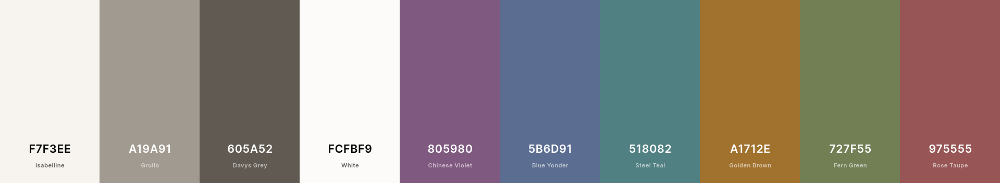

# Earl Grey Theme

A gentle color scheme for code.




## Todo

- [x] Alpha pallette
- [ ] Revise the Green/String color?
- [ ] Slightly warmer background?
- [x] Port to VSCode
- [ ] Port to Emacs/Doom
- [ ] Use for a while
- [ ] Extract core colors in a data file
- [ ] Demo site
- [ ] Builds for VSCode / Doom
- [ ] Port to Atom
- [ ] Terminal
- [ ] Iterate
- [ ] ??
- [ ] Beta testing
- [ ] Public release
- [ ] Patreon, etc?


## Color mapping

- String: green
- Number: teal
- Constant: teal
- Variable: blue
- Keyword: purple
- Special: orange
- Warning: red


## Code

```
/* CSS HEX */
--isabelline: #f7f3eeff;
--grullo: #a19a91ff;
--davys-grey: #605a52ff;
--white: #fcfbf9ff;
--chinese-violet: #805980ff;
--blue-yonder: #5b6d91ff;
--steel-teal: #518082ff;
--golden-brown: #a1712eff;
--fern-green: #727f55ff;
--rose-taupe: #975555ff;

/* CSS HSL */
--isabelline: hsla(33, 36%, 95%, 1);
--grullo: hsla(34, 8%, 60%, 1);
--davys-grey: hsla(34, 8%, 35%, 1);
--white: hsla(40, 33%, 98%, 1);
--chinese-violet: hsla(300, 18%, 43%, 1);
--blue-yonder: hsla(220, 23%, 46%, 1);
--steel-teal: hsla(182, 23%, 41%, 1);
--golden-brown: hsla(35, 56%, 41%, 1);
--fern-green: hsla(79, 20%, 42%, 1);
--rose-taupe: hsla(0, 28%, 46%, 1);

/* SCSS HEX */
$isabelline: #f7f3eeff;
$grullo: #a19a91ff;
$davys-grey: #605a52ff;
$white: #fcfbf9ff;
$chinese-violet: #805980ff;
$blue-yonder: #5b6d91ff;
$steel-teal: #518082ff;
$golden-brown: #a1712eff;
$fern-green: #727f55ff;
$rose-taupe: #975555ff;

/* SCSS HSL */
$isabelline: hsla(33, 36%, 95%, 1);
$grullo: hsla(34, 8%, 60%, 1);
$davys-grey: hsla(34, 8%, 35%, 1);
$white: hsla(40, 33%, 98%, 1);
$chinese-violet: hsla(300, 18%, 43%, 1);
$blue-yonder: hsla(220, 23%, 46%, 1);
$steel-teal: hsla(182, 23%, 41%, 1);
$golden-brown: hsla(35, 56%, 41%, 1);
$fern-green: hsla(79, 20%, 42%, 1);
$rose-taupe: hsla(0, 28%, 46%, 1);

/* SCSS RGB */
$isabelline: rgba(247, 243, 238, 1);
$grullo: rgba(161, 154, 145, 1);
$davys-grey: rgba(96, 90, 82, 1);
$white: rgba(252, 251, 249, 1);
$chinese-violet: rgba(128, 89, 128, 1);
$blue-yonder: rgba(91, 109, 145, 1);
$steel-teal: rgba(81, 128, 130, 1);
$golden-brown: rgba(161, 113, 46, 1);
$fern-green: rgba(114, 127, 85, 1);
$rose-taupe: rgba(151, 85, 85, 1);

/* SCSS Gradient */
$gradient-top: linear-gradient(0deg, #f7f3eeff, #a19a91ff, #605a52ff, #fcfbf9ff, #805980ff, #5b6d91ff, #518082ff, #a1712eff, #727f55ff, #975555ff);
$gradient-right: linear-gradient(90deg, #f7f3eeff, #a19a91ff, #605a52ff, #fcfbf9ff, #805980ff, #5b6d91ff, #518082ff, #a1712eff, #727f55ff, #975555ff);
$gradient-bottom: linear-gradient(180deg, #f7f3eeff, #a19a91ff, #605a52ff, #fcfbf9ff, #805980ff, #5b6d91ff, #518082ff, #a1712eff, #727f55ff, #975555ff);
$gradient-left: linear-gradient(270deg, #f7f3eeff, #a19a91ff, #605a52ff, #fcfbf9ff, #805980ff, #5b6d91ff, #518082ff, #a1712eff, #727f55ff, #975555ff);
$gradient-top-right: linear-gradient(45deg, #f7f3eeff, #a19a91ff, #605a52ff, #fcfbf9ff, #805980ff, #5b6d91ff, #518082ff, #a1712eff, #727f55ff, #975555ff);
$gradient-bottom-right: linear-gradient(135deg, #f7f3eeff, #a19a91ff, #605a52ff, #fcfbf9ff, #805980ff, #5b6d91ff, #518082ff, #a1712eff, #727f55ff, #975555ff);
$gradient-top-left: linear-gradient(225deg, #f7f3eeff, #a19a91ff, #605a52ff, #fcfbf9ff, #805980ff, #5b6d91ff, #518082ff, #a1712eff, #727f55ff, #975555ff);
$gradient-bottom-left: linear-gradient(315deg, #f7f3eeff, #a19a91ff, #605a52ff, #fcfbf9ff, #805980ff, #5b6d91ff, #518082ff, #a1712eff, #727f55ff, #975555ff);
$gradient-radial: radial-gradient(#f7f3eeff, #a19a91ff, #605a52ff, #fcfbf9ff, #805980ff, #5b6d91ff, #518082ff, #a1712eff, #727f55ff, #975555ff);

--------

/* CSV */
f7f3ee,a19a91,605a52,fcfbf9,805980,5b6d91,518082,a1712e,727f55,975555

/* Array */
["f7f3ee","a19a91","605a52","fcfbf9","805980","5b6d91","518082","a1712e","727f55","975555"]

/* Object */
{"Isabelline":"f7f3ee","Grullo":"a19a91","Davys Grey":"605a52","White":"fcfbf9","Chinese Violet":"805980","Blue Yonder":"5b6d91","Steel Teal":"518082","Golden Brown":"a1712e","Fern Green":"727f55","Rose Taupe":"975555"}

/* Extended Array */
[{"name":"Isabelline","hex":"f7f3ee","rgb":[247,243,238],"cmyk":[0,2,4,3],"hsb":[33,4,97],"hsl":[33,36,95],"lab":[96,0,3]},{"name":"Grullo","hex":"a19a91","rgb":[161,154,145],"cmyk":[0,4,10,37],"hsb":[34,10,63],"hsl":[34,8,60],"lab":[64,1,6]},{"name":"Davys Grey","hex":"605a52","rgb":[96,90,82],"cmyk":[0,6,15,62],"hsb":[34,15,38],"hsl":[34,8,35],"lab":[39,1,5]},{"name":"White","hex":"fcfbf9","rgb":[252,251,249],"cmyk":[0,0,1,1],"hsb":[40,1,99],"hsl":[40,33,98],"lab":[99,0,1]},{"name":"Chinese Violet","hex":"805980","rgb":[128,89,128],"cmyk":[0,30,0,50],"hsb":[300,30,50],"hsl":[300,18,43],"lab":[43,23,-16]},{"name":"Blue Yonder","hex":"5b6d91","rgb":[91,109,145],"cmyk":[37,25,0,43],"hsb":[220,37,57],"hsl":[220,23,46],"lab":[46,3,-22]},{"name":"Steel Teal","hex":"518082","rgb":[81,128,130],"cmyk":[38,2,0,49],"hsb":[182,38,51],"hsl":[182,23,41],"lab":[50,-15,-6]},{"name":"Golden Brown","hex":"a1712e","rgb":[161,113,46],"cmyk":[0,30,71,37],"hsb":[35,71,63],"hsl":[35,56,41],"lab":[51,12,43]},{"name":"Fern Green","hex":"727f55","rgb":[114,127,85],"cmyk":[10,0,33,50],"hsb":[79,33,50],"hsl":[79,20,42],"lab":[51,-12,21]},{"name":"Rose Taupe","hex":"975555","rgb":[151,85,85],"cmyk":[0,44,44,41],"hsb":[0,44,59],"hsl":[0,28,46],"lab":[44,27,12]}]
```
