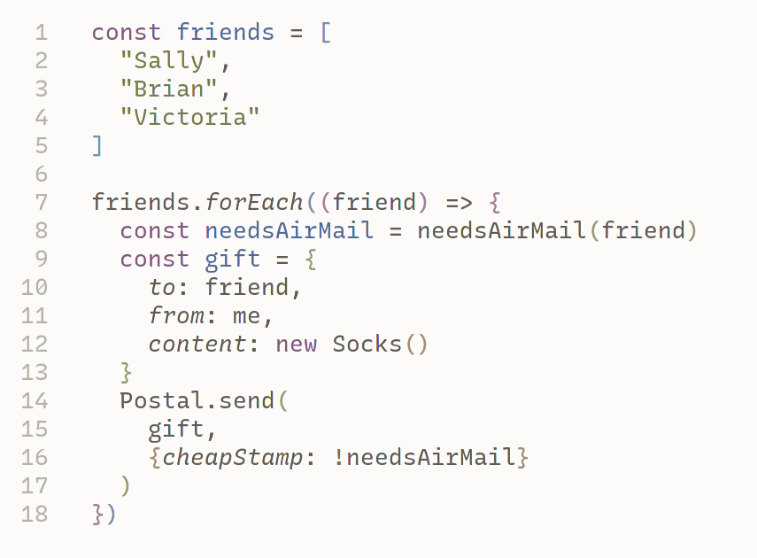

# Earl Grey Theme

A gentle color scheme for code.

## Design Principles

- Always favour easy readability
- Don't overload the reader with color
- Use a pale background color (White)
- Use the default text color (Black) as much as possible
- Use Purple for syntax elements (if / when)
- Use Blue for variables (foo)
- The most common colors should be White, Black, Purple, and Blue,
  in that order
- Use Italics to emphasise important elements, such as types,
  function names, and collection keys
  - Treat Italics as a color option
  - When appropriate, combine italics with another color
- When in doubt, prefer Black over any other color for text
- Use Grey for comments
- Use Teal for numbers and language constants, such as booleans
- Use Green for Strings
- Use Orange for special syntax that deserves to stand out
  - Such as pre-processor directives, and "dangerous" language elements
- Use Red to highlight errors
- Use Teal, Orange, and (maybe) Red sparingly, as the situation demands
- Use pale variants of the main colors for brackets
- Where possible, add custom rules for particular programming languages
